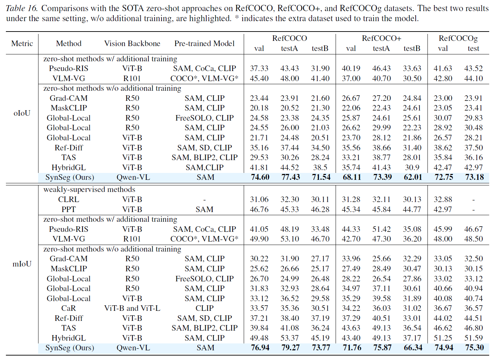

**Contents:**

1. **Visualization in Target-Constrained Scenarios.** 

2. **Performance Comparison of State-of-the-Art Models for Zero-shot Referring Segmentation.** 

3. **Zero-shot Referring Segmentation Visualization.**

--------------------------------------------------------------------------
**1. Visualization in Target-Constrained Scenarios.** For **reviewer ktHp** and other potentially interested reviewers or the AC.

--------------------------------------------------------------------------
**2. Performance Comparison of State-of-the-Art Models for Zero-shot Referring Segmentation.** For **reviewer DVpp** and other potentially interested reviewers or the AC.

Due to time constraints and the limited size of the zero-shot reference segmentation datasets, we have currently only supplemented the performance metrics for RefCOCO. The metrics for RefCOCO+ and RefCOCOg are expected to be updated within three days.

--------------------------------------------------------------------------
**3. Zero-shot Referring Segmentation Visualization.** For **reviewer DVpp** and other potentially interested reviewers or the AC.

